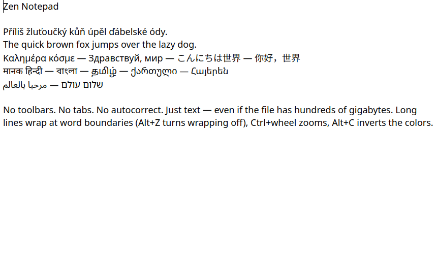

# Zen Notepad

A plain text editor in the spirit of the classic Windows Notepad, for Linux
(Qt 6, at home in KDE Plasma). A blank white window, no toolbars, no tabs,
one window per document. It starts instantly and never second-guesses what you type.



## Installation

**Flatpak (any distribution, also from KDE Discover):** download `ZenNotepad-<version>.flatpak` from the
[latest release](https://github.com/jirimilicka/ZenNotepad/releases/latest) and open it — Discover or
GNOME Software installs it with one click. From a terminal:

```sh
flatpak install --user ZenNotepad-1.0.2.flatpak
```

The KDE runtime it needs is downloaded from Flathub automatically. The app has full file system access
(it is a text editor: it must open and save files anywhere, and memory-maps huge files directly).

**From source:** see [Building](#building).

## Features

- **Instant start** (≈50 ms to the first frame on a typical desktop), always with an empty document
  unless a file is given.
- **UTF-8 only, done properly**: any script, combining marks, emoji, input methods (IBus, Fcitx).
  Invalid bytes are shown as � but saved back unchanged.
- **Right-to-left documents**: when right-to-left letters outnumber left-to-right ones,
  the whole document switches to RTL automatically.
- **Nothing automatic**: no auto-closing brackets, no autocorrect, no spell-check underlines,
  no syntax highlighting, no line numbers.
- **Huge files**: files are memory-mapped and edited through a piece tree, so a file of
  hundreds of gigabytes opens instantly and editing stays real-time. Saving is atomic.
- **Fast find and replace**, optionally case-sensitive and/or with PCRE2 regular expressions
  (`$1`, `${name}`, `\n`, `\t` in the replacement).
- Line endings (LF / CRLF) are preserved.

## Keyboard

| Keys | Action |
|---|---|
| Ctrl+S / Ctrl+Shift+S | Save / Save as |
| Ctrl+O, drag & drop | Open (in the same window) |
| Ctrl+N | New window |
| Ctrl+F / Ctrl+H | Find / Find and replace (Esc closes) |
| Enter / Shift+Enter (in the find field) | First match from the beginning / last match from the end |
| F3 / Shift+F3 | Next / previous match |
| Enter / Shift+Enter (in the replace field) | Replace the first match from the beginning / the last from the end |
| Ctrl+Alt+Enter | Replace all |
| Ctrl+wheel, Ctrl+plus / minus, Ctrl+0 | Zoom, reset zoom |
| Alt+Z | Toggle word wrap |
| Alt+C | Toggle inverted colors (white on black) |
| Ctrl+Z / Ctrl+Y | Undo / redo |

The interface is in English and Czech. The language follows the system by default and can
be changed in the right-click menu (*Language / Jazyk*).

## Building

Requirements: CMake, a C++17 compiler, Qt 6 (Widgets, DBus) and PCRE2.
On Debian/Ubuntu: `sudo apt install cmake g++ qt6-base-dev libpcre2-dev`.

```sh
./install.sh            # builds and installs into ~/.local
```

or manually:

```sh
cmake -S . -B build -DCMAKE_BUILD_TYPE=Release
cmake --build build
sudo cmake --install build
```

Tests (`zen_test`, `zen_fuzz`) are built when Qt Test is available:

```sh
QT_QPA_PLATFORM=offscreen build/zen_test && QT_QPA_PLATFORM=offscreen build/zen_fuzz
```

Flatpak: `flatpak run org.flatpak.Builder --user --install --force-clean build-flatpak io.github.jirimilicka.ZenNotepad.yml`

## How it is fast

- The document is the memory-mapped file plus an append-only buffer, indexed by a balanced
  piece tree; edits are O(log n) regardless of file size.
- Only visible paragraphs are laid out (Qt `QTextLayout`, HarfBuzz shaping, full bidi support).
  Absurdly long lines are split into chunks of ~32 KB for display.
- Search runs directly on the UTF-8 bytes in newline-aligned chunks (`memmem` or PCRE2 JIT).
- The KDE platform theme plugin is skipped at startup (it costs ~100 ms); the Breeze style is
  used directly and file dialogs go through xdg-desktop-portal, so they are still native.

## Authorship

Zen Notepad was created by **Claude Opus 5.5** (Anthropic's AI model): all of the code, the choice of
algorithms and data structures, the architecture, the tests and the packaging. Jiří Milička came up with
the idea, specified the requirements, made the design decisions, tested it in real use and maintains
the project.

## License

MIT, see [LICENSE](LICENSE).
